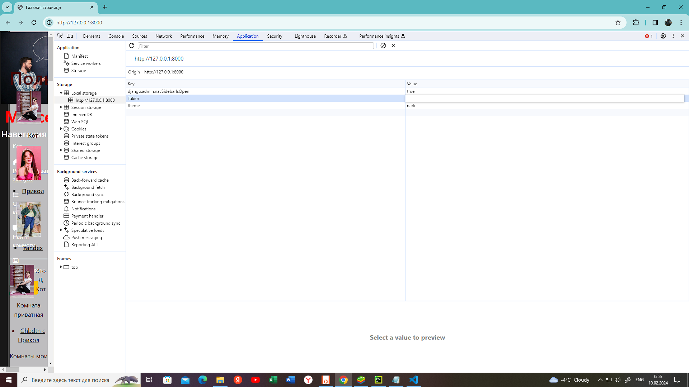
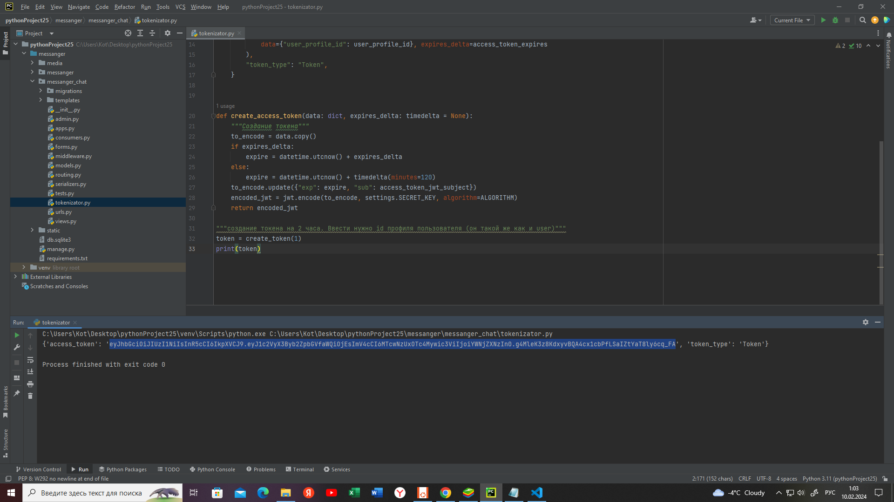
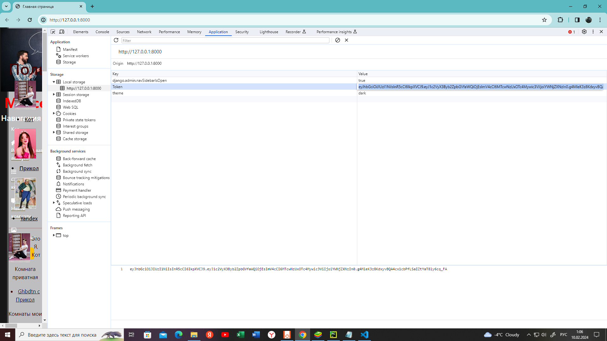
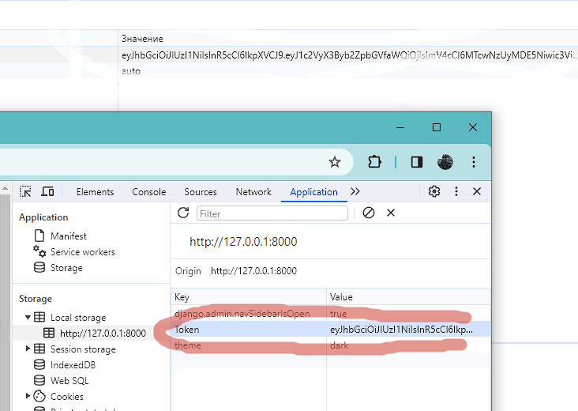
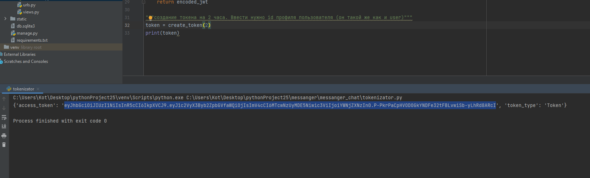
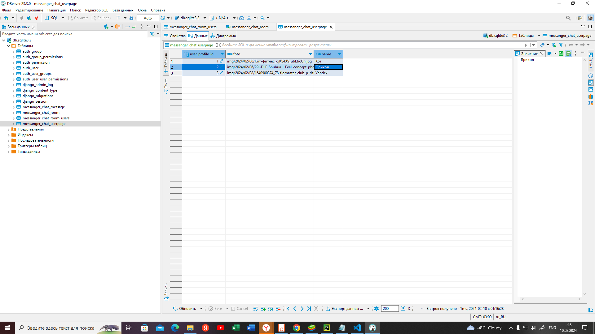
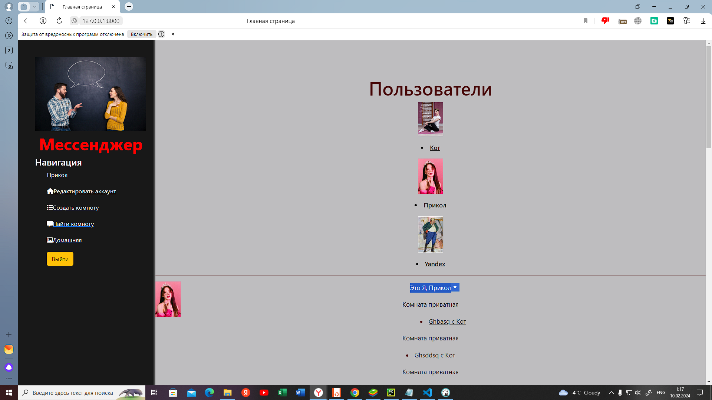

"# E6.9.-" 
1.После установки проекта необходимо подключить Redis с портом 6379

Запустить проект py manage.py runserver и перейти по ссылке http://127.0.0.1:8000/
В браузере, в котором будем работать, необходимо в закладке Application далее Local storage / http://127.0.0.1:8000/  в Token вести данные токена.
Токен мы получаем по пути **messanger/messanger_chat** открываем файл [text](../../Desktop/pythonProject25/messanger/messanger_chat/tokenizator.py) **tokenizator.py**  клавишамиShift+F10(запустить этот файл)create_toke(1),
где передаем  id пользователя 
Копируем и вставляем токе.
Токен работает 2 часа, затем необходимо обновить..
Пример токена для пользователя с user_profile_id=2 
Все необходивые библиотеки перечислены в файле [text](../../Desktop/pythonProject25/messanger/requirements.txt)