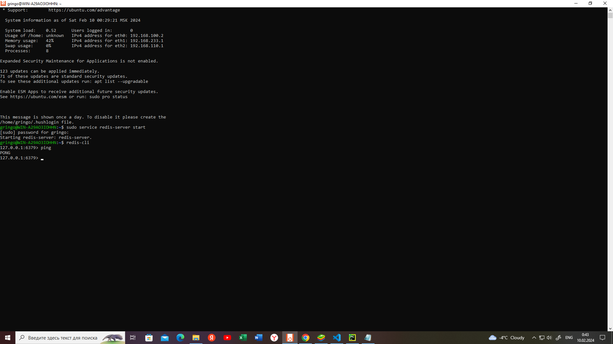

# Проект E6.9.-
<!-- # "# E6.9.-" 
# 1.После установки проекта необходимо подключить Redis с портом 6379
# 
# Запустить проект py manage.py runserver и перейти по ссылке http://127.0.0.1:8000/
# В браузере, в котором будем работать, необходимо в закладке Application далее Local storage / http://127.0.0.1:8000/  в Token вести данные токена.
# Токен мы получаем по пути **messanger/messanger_chat** открываем файл [text](messanger/messanger_chat/tokenizator.py) **tokenizator.py**  клавишамиShift+F10(запустить этот файл)create_toke(1),
# где передаем  id пользователя 
# Копируем и вставляем токе.
# Токен работает 2 часа, затем необходимо обновить..
# Пример токена для пользователя с user_profile_id=2 
# Все необходивые библиотеки перечислены в файле [text](messanger/requirements.txt) -->

## Описание

Мессенджер с принцепом работы WebSocket.

Этот проект предназначен для запуска приложения с использованием Python, виртуального окружения и Redis. Следуйте приведенным инструкциям, чтобы настроить и запустить проект.

---

## Требования

- **Python** версии 3.9 или выше.
- **Redis** (установите с [официального сайта](https://redis.io/)).

## Redis запуск

Нужен Ubuntu

Использовать WSL (Windows Subsystem for Linux)

Шаги:
Включите WSL:
1. Откройте PowerShell от имени администратора и выполните:    
    ```powershell

    wsl --install

2. Установите Redis:

    ```powershell

    sudo apt update

    sudo apt install redis-server

3. Запустите 
    ``` 
    sudo systemctl status redis-server

    redis-cli

Должен быть порт обязательно 6379 
    
    127.0.0.1:6379


---


## Установка

### 1. Проверьте наличие Python
Перед началом убедитесь, что Python установлен на вашем компьютере. Выполните команду в терминале:

    python --version
Если Python не установлен:

1. Скачайте Python с [официального сайта](https://www.python.org/).

2. Установите его, выбрав опцию Add Python to PATH во время установки.
3. После установки повторите команду:
    ```bash
    python --version

### 2. Убедитесь, что установлен pip
Проверьте наличие менеджера пакетов pip:

    pip --version

Если pip не установлен, выполните:

    python -m ensurepip --upgrade

### 3. Создайте виртуальное окружение

В корневой директории проекта выполните:

    python -m venv venv

### 4. Активируйте виртуальное окружение

Windows:

1. Для PowerShell:
    ```bash
    venv\Scripts\activate

2. В Bash:
    ```bash
    source venv/Scripts/activate

Для macOS/Linux

    source venv/bin/activate

После активации вы увидите название виртуального окружения в начале строки терминала, например:

    (venv) C:\Users\YourProject>

### 5. Установите зависимости

Убедитесь, что вы находитесь файл  в корневой директории проекта (messanger) Там requirements.txt находится. Затем выполните команду:

    pip install -r requirements.txt

## Запуск проекта

1. Убедитесь, что виртуальное окружение активно. Если оно не активно, активируйте его:

Для PowerShell:

    venv\Scripts\activate

В Bash:

    source venv/Scripts/activate

Для macOS/Linux

    source venv/bin/activate

2. Запустите сервер разработки:
    ```bash
    python manage.py runserver

3. Перейдите по адресу в браузере.

    http://127.0.0.1:8000/